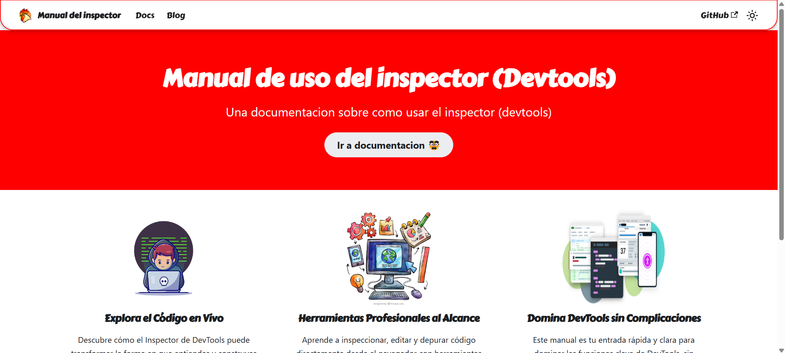

# 📘 Manual de uso del Inspector (DevTools) — Documentación con Docusaurus

Este proyecto es una guía interactiva y detallada sobre cómo utilizar el **Inspector de elementos (DevTools)** de los navegadores modernos, desarrollada con [Docusaurus 3.7](https://docusaurus.io/).



La documentación cubre funcionalidades clave como:

- Exploración del DOM con el panel **Elements**
- Análisis de rendimiento con **Performance**
- Depuración de código en **Sources**
- Control de almacenamiento con **Application**
- Monitorización de red en **Network**
- Uso de **Breakpoints**, **Watchers**, y mucho más

> Ideal para desarrolladores web que buscan dominar las herramientas de desarrollo del navegador.

---

## 📁 Estructura del proyecto

```
.
├── docs/               # Archivos markdown de la documentación
├── src/                # Personalizaciones del frontend (si existen)
├── static/             # Recursos estáticos
├── docusaurus.config.js
├── sidebars.js
├── package.json
└── README.md
```

---

## ✍️ Contribuciones

Si encuentras errores o deseas ampliar la documentación, ¡las contribuciones son bienvenidas! Haz un fork, crea tu rama y abre un pull request 😊

---

## 🌐 Demo (opcional)

Puedes ver una versión desplegada en Cpanel: [https://936920269.facturalo.co/docusaurus](https://936920269.facturalo.co/docusaurus)
